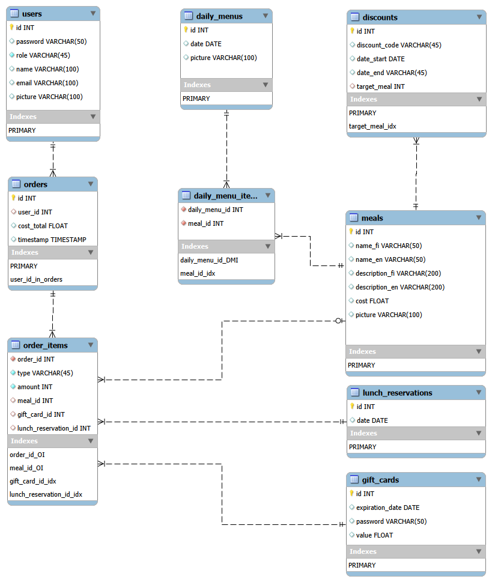

# wsk-restaurant
Metropolia Web Sovellus Kurssi- Projekti

  
### Ohje
Luo tietokanta scriptillä: database/create-database-v2.sql (Käytä uusinta versionumeroa.)
  Muista antaa ohjelmalle pääsy tietokantaan. Aseta käyttäjätunnus .env -tiedostolla.

  
### Tietokantasuunnitelma

<figure>

<figcaption>Tietokanta versio 3, luotu MySQL Workbenchin avulla.
</figcaption>
</figure>