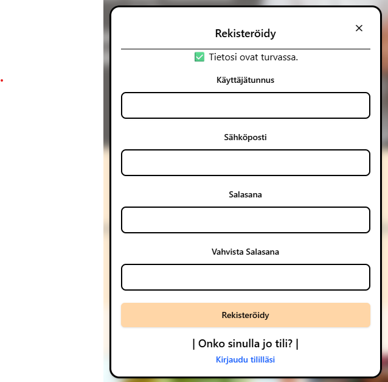
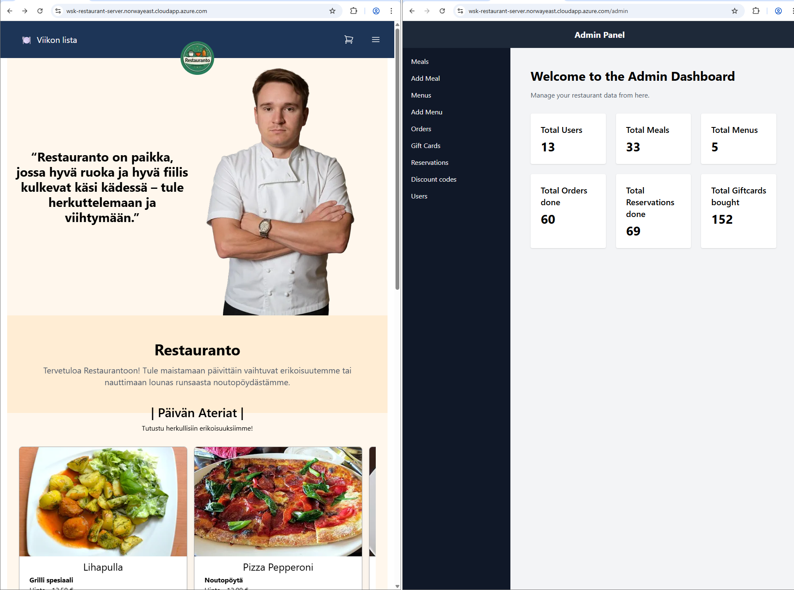
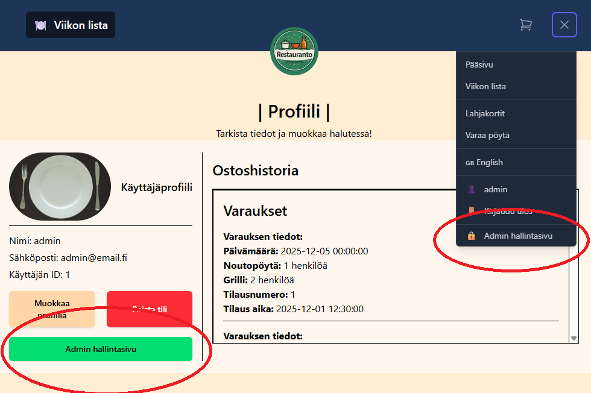

# wsk-restaurant aka Restauranto

Metropolia Web Sovellus Kurssi- Projekti
English version: [README_EN.md](./README_EN.md)

## Sovelluksen idea ja kohderyhmä

### Idea

Sovelluksen tarkoituksena on tarjota ravintoloille helppo tapa esitellä ruokalistojaan ja hallinnoida niitä verkossa. Ravintolat voivat luoda profiileja, lisätä ruokia, muokata hintoja ja päivittää valikoimiaan reaaliaikaisesti. Asiakkaat voivat selata ravintoloiden ruokalistoja, tehdä tilauksia, ostaa lahjakortteja sekä pitää kirjaa tilauksistaan.

### Kohderyhmä

Sovellus on suunnattu pienille ja keskisuurille ravintoloille, jotka haluavat parantaa näkyvyyttään verkossa ja tarjota asiakkailleen kätevän tavan tutustua ruokalistoihin ja tehdä tilauksia. Lisäksi sovellus palvelee asiakkaita, jotka etsivät uusia ravintoloita ja haluavat tehdä tilauksia helposti mobiililaitteillaan tai tietokoneillaan.

## Sovelluksen toiminnallisuudet

- Ravintoloiden profiilien luominen ja hallinnointi
- Ruokalistojen luominen, muokkaaminen ja päivittäminen
- Asiakkaiden tilauksien tekeminen ja hallinnointi
- Lahjakorttien ostaminen ja hallinnointi
- Käyttäjätilien luominen ja hallinnointi sekä ravintoloille että asiakkaille
- Reaaliaikaiset päivitykset ruokalistoihin ja tilauksiin
- Reaaliaikaiset lähimpien pysäkkien lähtevät tiedot
- Reaaliaikaiset säätiedot ja terassin aukiolo arvio

## Ohje testaukseen

### URL

Sovellus on deployattu Azureen osoitteeseen:
<https://wsk-restaurant-server.norwayeast.cloudapp.azure.com/>

API URL:
<https://wsk-restaurant-server.norwayeast.cloudapp.azure.com/api>

API dokumentaatio:
<https://wsk-restaurant-server.norwayeast.cloudapp.azure.com/api/docs>

### Testikäyttäjät

#### Admin

    käyttäjätunnus: 'admin'
    salasana: 'password'

#### User

    käyttäjätunnus: 'username'
    salasana: 'password'

#### Oma User

Sisäänkirjautumisruudussa on mahdollista luoda oma käyttäjä.
Rekisteröytyminen ei sulje ikkunaa, joten käyttäjän pitää siirtyä itse sisäänkirjautumiseen.

<figure>

</figure>

### Pääsyoikeudet

- Admin: Kaikki oikeudet (ravintoloiden ja käyttäjien hallinta)
- User: Rajoitetut oikeudet (vain omien tilausten ja profiilin hallinta)
- Guest: Vain lukuoikeudet (ruokalistat ja ravintolat)

### Testausohjeet

1. Tutki sivuja ensiksi ilman kirjautumista (Quest-käyttäjä)
2. Kirjaudu sisään user-käyttäjällä ja testaa tilauksen tekeminen ja profiilin hallinta
3. Kirjaudu sisään admin-käyttäjällä ja testaa ravintoloiden ja käyttäjien hallinta

   - Admin-paneeli löytyy hampurilaisvalikosta

4. Testaa eri toiminnallisuudet ja varmista, että kaikki toimii odotetusti

### Näkymät

Sovelluksessa on 2 päänäkymää: ravintolasivu ja admin hallintasivu

<figure>

</figure>

Admin käyttäjällä sisäänkirjautuminen näyttää linkit admin hallintasivulle

<figure>

</figure>

## Paikallisen kehitysympäristön pystytys

1. Varmista, että sinulla on asennettuna Node.js, npm ja MariaDB paikalliselle koneellesi

2. Asenna tietokanta MariaDB paikalliselle koneellesi

   - Luonti scriptit löytyvät kansiosta: ./database
   - Luo tietokanta ja taulut suorittamalla scriptit MariaDB:ssä
     - `Create-database-v6.sql`
       - Pelkkä tietokanta ja taulut
     - `Create-database-v6_with_mockdata.sql`
       - Tietokanta, taulut ja mock dataa testaukseen

3. Kloonaa repository paikalliselle koneellesi

4. Siirry projektin juurikansioon terminaalissa

5. Juuressa sijaitsee .env.sample tiedosto, kopioi se nimellä .env ja täytä tarvittavat ympäristömuuttujat

6. Asenna tarvittavat riippuvuudet komennoilla: `npm install` && `npm install --prefix client`

7. Käynnistä backend komennolla: `npm run dev`

8. Avaa uusi terminaali ikkuna ja siirry projektin juureen

9. Siirry frontend kansioon: `cd client`

10. Client juureen sijaitsee .env.sample tiedosto, kopioi se nimellä .env.local ja täytä tarvittavat ympäristömuuttujat asiakaspuolelle.

11. Käynnistä frontend komennolla:`npm run dev`

12. Avaa selain ja mene osoitteeseen: <http://localhost:PORT> portin löydät frontend konsolista

## Wireframe ja mockup kuvat

Wireframe ja mockup kuvat löytyvät kansiosta:
<https://docs.google.com/document/d/1Sk6Vxy49TRysr0Mrw0YkQo964_d_KIdPZG91kDWra_Y/edit?tab=t.0#heading=h.51cn9iikw1m0>

## Teknologiat

- Frontend: React.js, HTML, Tailwind CSS
- Backend: Node.js, Express.js
- Tietokanta: MariaDB
- Reaaliaikaiset tiedot: Kolmannen osapuolen API:t:
  - Säätiedot: Open Meteo API
  - Lähtevät tiedot: DigiTransit / HSL API
  - Kartat: Leaflet.js
- Autentikointi: JWT (JSON Web Tokens)
- Versiohallinta: Git ja GitHub
- CI/CD: GitHub Actions
- Pilvipalvelu: Microsoft Azure

## Suositukset

- Versiot: Käytä vähintään Node.js v18+ ja MariaDB v10.6+.
- Ympäristömuuttujat: Pidä `.env` tiedostossa vain pakolliset arvot. Asiakaspuolen muuttujat (`VITE_*`) tulee laittaa `client/.env.local`.
- Demo-tunnukset: Nämä ovat testitunnuksia. Poista tai vaihda tuotannossa.
- Tietoturva: Älä tallenna salaisia avaimia repoon. Käytä salaisuudenhallintaa (esim. GitHub Secrets / Azure Key Vault).
- API-avaimet: `HSL_API_KEY` on pakollinen HSL/Digitransit-kyselyihin. Hanki avain DigiTransitista.
- .env esimerkki: Muotoile arvot yhtenäisesti ja käytä vain kirjaimia/numeroita salaisuuksissa.

  #database
  DB_HOST=localhost
  DB_USER=appuser
  DB_PASSWORD=password
  DB_NAME=wsk_restaurant

  #server host
  SERVER_HOST=localhost
  SERVER_PORT=<VALITTU_PORTTI>

  #JSON web token
  JWT_SECRET=<OMA_SALAINEN_AVAIN>

  #API KEYS
  #DigiTransit
  HSL_API_KEY=<OMA_API_AVAIN>

- env.local esimerkki (client-kansio):

  VITE_BASE_URL=/

  VITE_USE_LOCAL_SERVER=false

  VITE_SERVER_URL_LOCAL=<http://localhost>:<VALITTU_PORTTI>
  VITE_API_URL_LOCAL=<http://localhost>:<VALITTU_PORTTI>/api

  VITE_SERVER_URL=<https://wsk-restaurant-server.norwayeast.cloudapp.azure.com>
  VITE_API_URL=<https://wsk-restaurant-server.norwayeast.cloudapp.azure.com/api>

- Koodin laatu: Aja lintteri ja formatteri ennen commitia (`npm run lint`, `npm run format` jos käytössä).
- Testaus: Hyödynnä `tests/`-kansiota API-testausta varten ja lisää omat skenaariot.
- Tietokanta: Pidä varmuuskopiot (`backup.bundle`) ajan tasalla ja käytä mock-dataa kehitykseen.
- Käytettävyys: Lisää kuville kuvaavat `alt`-tekstit ja varmista kontrasti/tägit saavutettavuuden vuoksi.

## Tiimi

- Riku Kuikka
- Topi Ahola
- Araz Muhammed
- Veijo Kasanen
